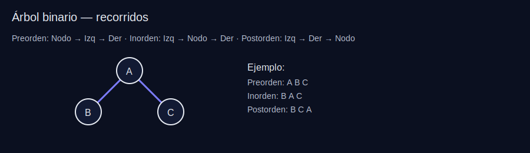
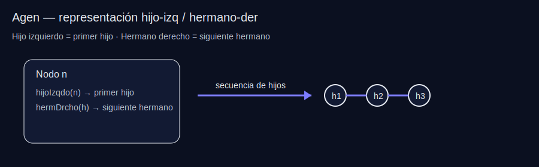
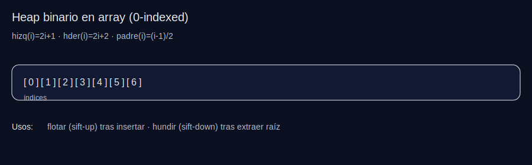
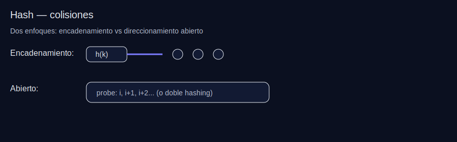
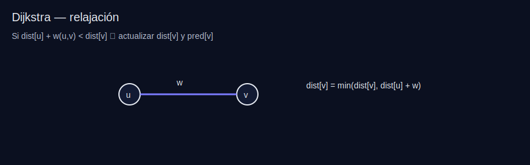

# Guía de Estudio EDNL - Examen Final

> **Formato del examen:** Teoría + código C++ usando TADs (Abin, Agen, Abb, GrafoP) y ejercicios resueltos tipo examen con esqueletos de código y razonamiento.

---

## ÍNDICE
1. [Árboles: Teoría](#1-árboles-teoría)
2. [Árboles: Implementación y Código](#2-árboles-código)
3. [Árboles: Ejercicios Tipo Examen](#3-ejercicios-árboles)
4. [Tablas Hash: Teoría](#4-tablas-hash)
5. [Grafos: Teoría](#5-grafos-teoría)
6. [Grafos: Implementación y Código](#6-grafos-código)
7. [Grafos: Ejercicios Tipo Examen](#7-ejercicios-grafos)
8. [Estrategia para el Examen](#8-estrategia)

---

## 1. ÁRBOLES: TEORÍA

### 1.1 Definición y Componentes

**Árbol:** Conjunto de elementos (nodos) donde cada nodo tiene un padre (excepto la raíz) y cero o más hijos. Sin ciclos.

**Definición formal:**
- Si `n` es un nodo y `A1, A2, ..., Ak` son árboles con raíces `n1, n2, ..., nk`
- `n` es padre de `n1, n2, ..., nk` (estos son hijos, entre sí son hermanos)

**Componentes:**
| Concepto | Definición |
|-----------|------------|
| **Raíz** | Único nodo sin ancestro |
| **Hoja** | Nodo sin descendientes propios (no tiene hijos) |
| **Grado** | Nº de hijos de un nodo. Grado del árbol = máximo grado de sus nodos |
| **Camino** | Sucesión de nodos n1, n2, ..., nk donde ni es padre de ni+1 |
| **Longitud** | Nº de aristas en un camino = k-1 |
| **Ancestros** | Nodos en el camino desde la raíz hasta un nodo |
| **Descendientes** | Nodos que tienen a `n` como ancestro |
| **Altura** | Longitud de la rama más larga desde un nodo hasta una hoja. Altura del árbol = altura de la raíz |
| **Profundidad** | Longitud del camino único desde la raíz hasta el nodo (también: nivel) |
| **Subárbol** | Conjunto formado por un nodo y todos sus descendientes |
| **Rama** | Camino que termina en una hoja |

### 1.2 Árbol Binario (TAD Abin)

Árbol donde cada nodo tiene **0, 1 o 2 hijos** (grado ≤ 2).

**Especificación del TAD Abin:**
```cpp
template <typename T> class Abin {
public:
    Abin();                          // Crea árbol vacío
    void insertarRaiz(const T& e);    // Inserta raíz (árbol vacío)
    void insertarHijoIzqdo(nodo n, const T& e);  // Inserta hijo izquierdo
    void insertarHijoDrcho(nodo n, const T& e);   // Inserta hijo derecho
    void eliminarHijoIzqdo(nodo n);     // Elimina hijo izquierdo (debe ser hoja)
    void eliminarHijoDrcho(nodo n);      // Elimina hijo derecho (debe ser hoja)
    bool arbolVacio() const;             // ¿Está vacío?
    const T& elemento(nodo n) const;     // Devuelve elemento del nodo
    nodo raiz() const;                    // Devuelve nodo raíz (o NODO_NULO)
    nodo padre(nodo n) const;             // Devuelve padre de n
    nodo hijoIzqdo(nodo n) const;       // Devuelve hijo izquierdo
    nodo hijoDrcho(nodo n) const;        // Devuelve hijo derecho
    static const nodo NODO_NULO;         // Representa "nodo inexistente"
private:
    // Una de las siguientes implementaciones...
};
```

**Recorridos de un AB:**
| Recorrido | Orden | Uso típico |
|-----------|-------|-------------|
| **Preorden** | Nodo → Izq → Der | Copiar árbol, prefijos |
| **Inorden** | Izq → Nodo → Der | ABB → claves ordenadas |
| **Postorden** | Izq → Der → Nodo | Eliminar árbol, sufijos |
| **Por niveles (BFS)** | Nivel 0, 1, 2... | Distancia a raíz, árboles completos |



### 1.3 Árbol General (TAD Agen)

Árbol donde cada nodo puede tener **cualquier número de hijos**.

**Diferencia clave vs binario:** No hay hijo derecho/izquierdo, sino **hijo izquierdo** y **hermano derecho**.

```cpp
template <typename T> class Agen {
public:
    Agen();
    void insertarHijoIzqdo(nodo n, const T& e);  // Primer hijo (o nuevo primer hijo)
    void insertarHermDrcho(nodo n, const T& e);   // Hermano derecho de n
    nodo hijoIzqdo(nodo n) const;      // Primer hijo
    nodo hermDrcho(nodo n) const;       // Siguiente hermano
    // ... resto similar a Abin
};
```

**Truco:** Representar árbol general como binario (hijo-hermano):
- Hijo izquierdo = primer hijo
- Hijo derecho = siguiente hermano



### 1.4 ABB (Árbol Binario de Búsqueda)

**Invariante:** Para cada nodo `n`:
- Claves en subárbol izquierdo < elemento(n)
- Claves en subárbol derecho > elemento(n)
- No hay valores repetidos (estricto)

**Complejidad:**
- Mejor caso (equilibrado): O(log n)
- Peor caso (degenerado en lista): O(n)

**Operaciones típicas:**
- `buscar(e)`: devuelve subárbol cuya raíz contiene e
- `insertar(e)`: inserta manteniendo invariante
- `eliminar(e)`: 3 casos (hoja / 1 hijo / 2 hijos)

**Ínfimo/Supremo:**
- Ínfimo(x): mayor clave ≤ x
- Supremo(x): menor clave ≥ x

### 1.5 Árboles Equilibrados (AVL y ARN)

**AVL:** ABB + para cada nodo: |h(izq) - h(der)| ≤ 1

**Rotaciones AVL:** LL, RR, LR, RL (re-equilibran tras inserción/eliminación)

**ARN (Rojo-Negro):** ABB coloreado (rojo/negro) con propiedades de equilibrio.
- Garantiza altura O(log n)
- Menos rotaciones que AVL en inserción/eliminación

**Comparación:**
| Criterio | AVL | ARN |
|----------|-----|-----|
| Equilibrio | Más estricto (deseq ≤ 1) | Más flexible |
| Búsqueda | Más rápida (árbol más equilibrado) | Ligeramente más lenta |
| Inserción/Eliminación | Más rotaciones | Menos rotaciones |

### 1.6 Árboles Parcialmente Ordenados (APO / Heap)

**Propiedad:** Cada nodo ≤ (min-heap) o ≥ (max-heap) que sus hijos.

**Operaciones:**
- `insertar(e)`: colocar al final + flotar (sift-up)
- `extraerMin/Max()`: sacar raíz, subir último a raíz + hundir (sift-down)
- `consultarMin/Max()`: O(1)

**Implementación típica:** Vector (como heap binario completo):
- Hijo izquierdo de i: 2i+1 (si 0-indexed)
- Hijo derecho de i: 2i+2



---

## 2. ÁRBOLES: CÓDIGO

### 2.1 Implementación Enlazada de Abin

```cpp
template <typename T> class Abin {
public:
    typedef celda* nodo;  // O usar índices según diseño
    // ...
private:
    struct celda {
        T elto;
        nodo padre, hizq, hder;
        celda(const T& e, nodo p = NODO_NULO)
            : elto(e), padre(p), hizq(NODO_NULO), hder(NODO_NULO) {}
    };
    nodo r;  // raíz
    static const nodo NODO_NULO = nullptr;  // o índice especial
};
```

**Cálculo de altura:**
```cpp
template <typename T>
int alturaAbin_rec(typename Abin<T>::nodo n, const Abin<T>& A) {
    if (n == Abin<T>::NODO_NULO) return -1;  // convenio: altura nodo nulo = -1
    return 1 + std::max(
        alturaAbin_rec(A.hijoIzqdo(n), A),
        alturaAbin_rec(A.hijoDrcho(n), A)
    );
}
```

**Cálculo de número de nodos:**
```cpp
template <typename T>
size_t contarNodos(const Abin<T>& A) {
    if (A.arbolVacio()) return 0;
    return contarNodos_rec(A.raiz(), A);
}

template <typename T>
size_t contarNodos_rec(typename Abin<T>::nodo n, const Abin<T>& A) {
    if (n == Abin<T>::NODO_NULO) return 0;
    return 1 
        + contarNodos_rec(A.hijoIzqdo(n), A)
        + contarNodos_rec(A.hijoDrcho(n), A);
}
```

### 2.2 Inserción y Eliminación en ABB

**Buscar en ABB:**
```cpp
template <typename T>
const Abb<T>& Abb<T>::buscar(const T& e) const {
    if (r == nullptr) return *this;           // árbol vacío
    else if (e < r->elto) return r->izq.buscar(e);  // subárbol izquierdo
    else if (r->elto < e) return r->der.buscar(e);  // subárbol derecho
    else return *this;  // encontrado
}
```

**Eliminación (3 casos):**
```cpp
// Caso 1: Hoja → eliminar directamente
// Caso 2: Un hijo → sustituir por ese hijo
// Caso 3: Dos hijos → sustituir por ínfimo del der o sup del izq
```

### 2.3 Ejercicio Típico: Árbol Binario Reflejado

**Enunciado:** Dado un árbol binario, crear otro intercambiando los subárboles.

**Idea clave:** reflejar = intercambiar sistemáticamente **hijo izquierdo ↔ hijo derecho** en cada nodo.

**Paso a paso (receta):**
1. Crear árbol `B` vacío.
2. Si `A` está vacío → devolver `B`.
3. Copiar la raíz de `A` en la raíz de `B`.
4. DFS recursivo: para cada nodo `a` en `A` y su “espejo” `b` en `B`:
   - Si existe `hijoDrcho(a)` → insertarlo como `hijoIzqdo(b)`.
   - Si existe `hijoIzqdo(a)` → insertarlo como `hijoDrcho(b)`.
   - Repetir con los pares de hijos correspondientes.

> **Caso borde:** árbol vacío → resultado vacío.

<details>
  <summary>Ver solución (C++)</summary>

```cpp
template <typename T>
Abin<T> AbinReflejado(const Abin<T>& A) {
    Abin<T> Reflejado;
    if (!A.arbolVacio()) {
        Reflejado.insertarRaiz(A.elemento(A.raiz()));
        AbinReflejado_rec(A.raiz(), Reflejado.raiz(), A, Reflejado);
    }
    return Reflejado;
}

template <typename T>
void AbinReflejado_rec(typename Abin<T>::nodo a,
                       typename Abin<T>::nodo b,
                       const Abin<T>& A,
                       Abin<T>& B) {
    if (a != Abin<T>::NODO_NULO) {
        // Insertar hijo izquierdo de B = hijo derecho de A
        if (A.hijoDrcho(a) != Abin<T>::NODO_NULO)
            B.insertarHijoIzqdo(b, A.elemento(A.hijoDrcho(a)));
        AbinReflejado_rec(A.hijoDrcho(a), B.hijoIzqdo(b), A, B);

        // Insertar hijo derecho de B = hijo izquierdo de A
        if (A.hijoIzqdo(a) != Abin<T>::NODO_NULO)
            B.insertarHijoDrcho(b, A.elemento(A.hijoIzqdo(a)));
        AbinReflejado_rec(A.hijoIzqdo(a), B.hijoDrcho(b), A, B);
    }
}
```

<p><strong>Complejidad:</strong> O(n) (visitas cada nodo una vez). <strong>Espacio:</strong> O(h) por la recursión.</p>
<p><strong>Ojo:</strong> no llames a <code>elemento()</code> con <code>NODO_NULO</code>. Primero comprueba si el hijo existe.</p>
</details>

### 2.4 Comprobar si un Árbol es AVL

**Qué hay que demostrar:** que en **cada nodo** se cumple `|h(izq) - h(der)| ≤ 1` y que los dos subárboles también son AVL.

**Intuición:** si recalculas altura desde cero en cada nodo te sale O(n²). En examen, la solución “limpia” es devolver (AVL?, altura) en un solo recorrido.

**Plantilla (pasos):**
1. Caso base: nodo nulo → (true, -1) (convenio típico).
2. Resolver recursivamente izquierda y derecha.
3. Altura = 1 + max(hIzq, hDer).
4. AVL? = izqOK && derOK && |hIzq-hDer| ≤ 1.

> **Caso borde:** define el convenio de altura (muy típico: altura(nulo) = -1, altura(hoja)=0).

<details>
  <summary>Ver solución (C++)</summary>

```cpp
template <typename T>
bool esAVL(const Abin<T>& A) {
    return esAVL_rec(A.raiz(), A).first;  // .first = ¿es AVL?
}

template <typename T>
std::pair<bool, int> esAVL_rec(typename Abin<T>::nodo n, const Abin<T>& A) {
    if (n == Abin<T>::NODO_NULO) 
        return {true, -1};  // Nodo nulo: equilibrado, altura -1
    
    auto [izqOK, hIzq] = esAVL_rec(A.hijoIzqdo(n), A);
    auto [derOK, hDer] = esAVL_rec(A.hijoDrcho(n), A);
    
    int altura = 1 + std::max(hIzq, hDer);
    bool equilibrado = izqOK && derOK && std::abs(hIzq - hDer) <= 1;
    
    return {equilibrado, altura};
}
```

<p><strong>Complejidad:</strong> O(n). <strong>Espacio:</strong> O(h) por recursión.</p>
<p><strong>Errores típicos:</strong> (1) mezclar convenios de altura, (2) recalcular alturas con una función aparte dentro de la recursión (te vas a O(n²)).</p>
</details>

---

## 3. EJERCICIOS ÁRBOLES (Tipo Examen)

### 3.1 Árbol Binario Reflejado ✅ (Visto arriba)

### 3.2 Árbol General Reflejado

```cpp
template <typename T>
Agen<T> AgenReflejado(const Agen<T>& A) {
    Agen<T> Reflejado;
    if (!A.arbolVacio()) {
        Reflejado.insertarRaiz(A.elemento(A.raiz()));
        AgenReflejado_rec(A.raiz(), Reflejado.raiz(), A, Reflejado);
    }
    return Reflejado;
}
// Lógica: intercambiar primer hijo ↔ hermano derecho recursivamente
```

### 3.3 Árboles Generales Similares

**Enunciado:** Determinar si dos árboles generales tienen la misma estructura (mismo número de hijos en cada nodo, misma forma).

```cpp
template <typename T>
bool similares(const Agen<T>& A, const Agen<T>& B) {
    return similares_rec(A.raiz(), A, B.raiz(), B);
}
// Caso base: ambos nulos → true; uno nulo otro no → false
// Comparar recursivamente: primer hijo A vs primer hijo B (y sus hermanos)
```

### 3.4 Contar Nodos "Verdes" (o con cierta propiedad)

```cpp
// Ejemplo: contar nodos que cumplen predicado P
template <typename T>
size_t contarNodosVerdes(typename Abin<T>::nodo n, const Abin<T>& A) {
    if (n == Abin<T>::NODO_NULO) return 0;
    size_t cuenta = (esVerde(A.elemento(n))) ? 1 : 0;
    return cuenta 
        + contarNodosVerdes(A.hijoIzqdo(n), A)
        + contarNodosVerdes(A.hijoDrcho(n), A);
}
```

### 3.5 Flotar/Hundir Nodos (heap operations)

**Qué es:** operaciones básicas de un **heap binario** tras insertar (flotar) o tras extraer la raíz (hundir).

**Idea clave:** en un heap en array, solo puede violarse la propiedad en el camino desde el nodo insertado hacia la raíz (flotar) o desde la raíz hacia abajo (hundir).

**Plantilla (pasos):**
- Flotar: mientras `i > 0` y heap[i] “mejor” que su padre → intercambiar y subir.
- Hundir: mientras exista hijo → intercambiar con el mejor hijo (min hijo para min-heap).

> **Caso borde:** en `hundir`, comprueba siempre si existe hijo derecho antes de compararlo.

<details>
  <summary>Ver solución (C++)</summary>

```cpp
// Flotar (usado tras inserción en heap)
template <typename T>
void flotar(vector<T>& heap, size_t i) {
    while (i > 0) {
        size_t padre = (i - 1) / 2;
        if (heap[i] >= heap[padre]) break;  // min-heap
        swap(heap[i], heap[padre]);
        i = padre;
    }
}

// Hundir (usado tras extraer mínimo)
template <typename T>
void hundir(vector<T>& heap, size_t i) {
    size_t n = heap.size();
    while (2*i + 1 < n) {
        size_t hijo = 2*i + 1;
        if (hijo + 1 < n && heap[hijo + 1] < heap[hijo]) hijo++;
        if (heap[i] <= heap[hijo]) break;
        swap(heap[i], heap[hijo]);
        i = hijo;
    }
}
```

<p><strong>Complejidad:</strong> O(log n) en ambos casos. <strong>Espacio:</strong> O(1).</p>
<p><strong>Errores típicos:</strong> (1) olvidar actualizar <code>i</code>, (2) elegir mal el hijo en min-heap, (3) no controlar límites del array.</p>
</details>

### 3.6 Subárbol Izquierdo Menor que Derecho

```cpp
// Verificar si para todo nodo: suma(subárbol izquierdo) < suma(subárbol derecho)
template <typename T>
bool subarbolIzqMenorDer(const Abin<T>& A) {
    return subarbolIzqMenorDer_rec(A.raiz(), A).first;
}
// Retornar {cumple, suma} para cada subárbol
```

### 3.7 Agenda ABB (Eliminar y reinsertar)

```cpp
// Construir ABB de contactos (clave = nombre, dato = teléfono)
// Buscar, insertar, eliminar con criterio ABB
```

---

## 4. TABLAS HASH: TEORÍA

### 4.1 Conceptos Básicos

**Tabla Hash:** Estructura para asociar clave → posición mediante función hash `h(clave)`.

**Función hash ideal:** Uniforme (distribuye claves uniformemente), rápida de calcular.

**Factor de carga:** α = n/m (n = elementos, m = tamaño tabla)
- α alto → más colisiones → peor rendimiento
- Umbral típico para rehashing: α ≈ 0.7-0.8

### 4.2 Resolución de Colisiones



| Método | Idea | Ventajas | Inconvenientes |
|--------|-----|---------|----------------|
| **Hashing cerrado** | Todos los elementos en el array. Sondeo (lineal, cuadrático, doble hash) | Sin punteros extra | Borrado complejo (tumbas), agrupación |
| **Hashing abierto** | Cada posición apunta a lista (encadenamiento) | Borrado sencillo | Overhead de punteros |
| **Encadenamiento mezclado** | Híbrido | Balance | Más complejo |

### 4.3 Rehashing

Cuando α supera umbral:
1. Crear tabla mayor (típicamente 2×)
2. Reinsertar todas las claves (recalcular hash)
3. Coste amortizado: O(1)

### 4.4 Hash vs Árboles de Búsqueda

| Criterio | Hash (esperado) | ABB equilibrado |
|----------|-----------------|---------------|
| Búsqueda | O(1) | O(log n) |
| Inserción | O(1) | O(log n) |
| Orden | No mantiene orden | Sí (inorden) |
| Dependencia | Calidad del hash | Equilibrio del árbol |

---

## 5. GRAFOS: TEORÍA

### 5.1 Definición y Tipos

**Grafo G = (V, A):**
- V: conjunto de vértices (nodos)
- A: conjunto de aristas/arcos (pares de vértices)

**Tipos:**
- **No dirigido:** (v, w) = (w, v)
- **Dirigido:** (v, w) ≠ (w, v) (arco)
- **Ponderado:** cada arista tiene un peso (coste, distancia, tiempo)

### 5.2 Representaciones

| Representación | Espacio | Comprobar arista (v,w) | Iterar vecinos |
|----------------|---------|----------------------|----------------|
| **Matriz adyacencia** | O(V²) | O(1) | O(V) |
| **Lista adyacencia** | O(V+E) | O(grado(v)) | O(grado(v)) |

**Cuándo usar cuál:**
- Grafo denso (muchas aristas): matriz
- Grafo disperso (pocas aristas): lista

### 5.3 Definiciones Importantes

- **Grado (no dirigido):** nº aristas incidentes al vértice
- **Grado entrada/salida (dirigido):** aristas que llegan / salen
- **Camino:** sucesión de vértices n1, n2, ..., nk donde (ni, ni+1) ∈ A
- **Longitud:** nº de aristas = k-1
- **Grafo conexo:** hay camino entre cualquier par de vértices
- **Grafo completo:** hay arista entre cada par de vértices
- **Subgrafo:** G' = (V', A') donde A' ⊆ A y V' son vértices de esas aristas

### 5.4 Recorridos de Grafos

**BFS (Anchura):**
- Usa cola
- Calcula distancias mínimas (en nº de aristas) en grafos no ponderados
- Produce árbol de expansión por niveles

**DFS (Profundidad):**
- Usa pila o recursión
- Explorar componentes, detectar ciclos, orden topológico (DAG)

### 5.5 Caminos de Coste Mínimo

**Dijkstra:**
- ✅ Requiere: pesos no negativos
- ✅ Calcula: caminos mínimos desde un origen a todos los vértices
- Con cola prioridad: O((V+E) log V)
- ❌ NO usar con pesos negativos

**Floyd:**
- Calcula: caminos mínimos entre TODOS los pares
- Programación dinámica: O(V³) tiempo, O(V²) espacio
- Versión booleana: Warshall (clausura transitiva / alcanzabilidad)

### 5.6 Árboles Generadores Mínimos (MST)

**Kruskal:**
1. Ordenar aristas por peso creciente
2. Añadir arista si no crea ciclo (usar Union-Find)
3. Repetir hasta tener V-1 aristas

**Prim:**
1. Crecer árbol desde un vértice
2. Añadir arista mínima que conecte árbol con vértice nuevo
3. Con heap: O(E log V)

**Union-Find (TAD Partición):**
- `make-set`, `find`, `union`
- Con compresión de caminos + unión por rango: casi O(1) amortizado

---

## 6. GRAFOS: CÓDIGO

### 6.1 TAD GrafoP (Grafo Ponderado)

```cpp
template <typename tCoste>
class GrafoP {
public:
    typedef size_t vertice;
    GrafoP(size_t n, const tCoste& c = INFINITO);
    size_t numVert() const { return ady.size(); }
    const vector<tCoste>& operator[](vertice v) const { return ady[v]; }
    static const tCoste INFINITO;
private:
    vector<vector<tCoste>> ady;  // matriz de costes
};
```

### 6.2 Dijkstra



```cpp
template <typename tCoste>
vector<tCoste> Dijkstra(const GrafoP<tCoste>& G,
                          typename GrafoP<tCoste>::vertice origen,
                          vector<typename GrafoP<tCoste>::vertice>& P) {
    typedef typename GrafoP<tCoste>::vertice vertice;
    const size_t n = G.numVert();
    vector<tCoste> D(n, INFINITO);     // distancias mínimas
    P = vector<vertice>(n, origen);    // vértice anterior
    vector<bool> S(n, false);           // conjunto de vértices finalizados
    
    D[origen] = 0;
    for (size_t i = 0; i < n; i++) {
        // Seleccionar vértice w no en S con D mínimo
        vertice w = 0;
        tCoste costeMinimo = INFINITO;
        for (vertice v = 0; v < n; v++)
            if (!S[v] && D[v] < costeMinimo) {
                costeMinimo = D[v];
                w = v;
            }
        S[w] = true;
        
        // Recalcular D a través de w
        for (vertice v = 0; v < n; v++) {
            tCoste Owv = suma(D[w], G[w][v]);
            if (Owv < D[v]) {
                D[v] = Owv;
                P[v] = w;
            }
        }
    }
    return D;
}

template <typename tCoste>
tCoste suma(tCoste x, tCoste y) {
    if (x == INFINITO || y == INFINITO) return INFINITO;
    return x + y;
}
```

### 6.3 Floyd

```cpp
template <typename tCoste>
matriz<tCoste> Floyd(const GrafoP<tCoste>& G,
                     matriz<typename GrafoP<tCoste>::vertice>& P) {
    typedef typename GrafoP<tCoste>::vertice vertice;
    const size_t n = G.numVert();
    matriz<tCoste> A(n);  // matriz de costes mínimos
    
    // Inicializar con costes del grafo
    for (vertice i = 0; i < n; i++) {
        A[i] = G[i];
        A[i][i] = 0;  // coste a sí mismo = 0
        P[i] = vector<vertice>(n, i);  // vértice intermedio inicial
    }
    
    // DP: camino mínimo pasando por k
    for (vertice k = 0; k < n; k++)
        for (vertice i = 0; i < n; i++)
            for (vertice j = 0; j < n; j++) {
                tCoste ikj = suma(A[i][k], A[k][j]);
                if (ikj < A[i][j]) {
                    A[i][j] = ikj;
                    P[i][j] = k;  // pasa por k
                }
            }
    return A;
}
```

### 6.4 Warshall (Clausura Transitiva)

```cpp
matriz<bool> Warshall(const Grafo& G) {
    const size_t n = G.numVert();
    matriz<bool> A(n);
    
    // Inicializar: hay camino si hay arista directa
    for (size_t i = 0; i < n; i++) {
        for (size_t j = 0; j < n; j++)
            A[i][j] = (i == j) || (G[i][j] != INFINITO);
    }
    
    // Clausura transitiva: camino pasando por k
    for (size_t k = 0; k < n; k++)
        for (size_t i = 0; i < n; i++)
            for (size_t j = 0; j < n; j++)
                A[i][j] = A[i][j] || (A[i][k] && A[k][j]);
    
    return A;
}
```

### 6.5 TAD Partición (Union-Find) para Kruskal

```cpp
class Particion {
public:
    Particion(int n) : padre(n, -1) {}  // cada elemento es su propio representante
    
    void unir(int a, int b) {
        // Unir subconjuntos de a y b (por altura)
        int raizA = encontrar(a), raizB = encontrar(b);
        if (raizA == raizB) return;
        if (padre[raizA] > padre[raizB]) swap(raizA, raizB);  // raizA más alta
        if (padre[raizA] == padre[raizB]) padre[raizA]--;  // mismo tamaño → crece altura
        padre[raizB] = raizA;  // raizB cuelga de raizA
    }
    
    int encontrar(int x) const {
        int raiz = x;
        while (padre[raiz] >= 0) raiz = padre[raiz];  // buscar raíz
        // Compresión de caminos
        while (x != raiz) {
            int y = padre[x];
            padre[x] = raiz;
            x = y;
        }
        return raiz;
    }
private:
    mutable vector<int> padre;  // padre[i] < 0 → es raíz (valor = -altura)
};
```

### 6.6 Kruskal


```cpp
// Estructura para aristas
struct Arista {
    size_t orig, dest;
    size_t peso;
};

GrafoP<size_t> Kruskal(const GrafoP<size_t>& G) {
    const size_t n = G.numVert();
    GrafoP<size_t> MST(n);  // árbol generador (inicialmente sin aristas)
    Particion P(n);
    
    // Recopilar y ordenar aristas por peso
    vector<Arista> aristas;
    for (size_t i = 0; i < n; i++)
        for (size_t j = i+1; j < n; j++)  // grafo no dirigido
            if (G[i][j] != INFINITO)
                aristas.push_back({i, j, G[i][j]});
    
    sort(aristas.begin(), aristas.end(),
         [](const Arista& a, const Arista& b) { return a.peso < b.peso; });
    
    size_t aristasMST = 0;
    for (const auto& a : aristas) {
        if (aristasMST >= n-1) break;
        int raizOrig = P.encontrar(a.orig);
        int raizDest = P.encontrar(a.dest);
        if (raizOrig != raizDest) {  // no crea ciclo
            MST[a.orig][a.dest] = MST[a.dest][a.orig] = a.peso;
            P.unir(raizOrig, raizDest);
            aristasMST++;
        }
    }
    return MST;
}
```

### 6.7 Prim

```cpp
GrafoP<size_t> Prim(const GrafoP<size_t>& G) {
    const size_t n = G.numVert();
    GrafoP<size_t> MST(n);
    vector<bool> enMST(n, false);
    vector<size_t> coste(n, INFINITO);
    vector<size_t> padre(n, n);  // padre en MST
    
    coste[0] = 0;  // empezar desde vértice 0
    
    for (size_t i = 0; i < n; i++) {
        // Seleccionar vértice fuera del MST con coste mínimo
        size_t v = 0;
        size_t minCoste = INFINITO;
        for (size_t u = 0; u < n; u++)
            if (!enMST[u] && coste[u] < minCoste) {
                minCoste = coste[u];
                v = u;
            }
        
        enMST[v] = true;
        if (padre[v] != n)  // no es la raíz
            MST[v][padre[v]] = MST[padre[v]][v] = G[v][padre[v]];
        
        // Actualizar costes a través de v
        for (size_t u = 0; u < n; u++)
            if (!enMST[u] && G[v][u] < coste[u]) {
                coste[u] = G[v][u];
                padre[u] = v;
            }
    }
    return MST;
}
```

---

## 7. EJERCICIOS GRAFOS (Tipo Examen)

### 7.1 Ciudades Rebeldes (Zuelandia)

**Enunciado:** Calcular matriz de costes mínimos para viajar entre ciudades de Zuelandia donde:
- a) Carreteras de un solo sentido (grafo dirigido)
- b) Ciudades rebeldes inaccesibles (no pueden usarse)
- c) Carreteras cortadas (no pueden usarse)
- d) Todos los viajes deben pasar por la capital

**Solución:** Usar Floyd modificado + obligar paso por capital.

**Cómo pensarlo (modo profe):**
1. **Modela el grafo** dirigido con pesos (carreteras).
2. **Aplica restricciones** antes de buscar mínimos:
   - Ciudad rebelde `c`: anula **toda entrada** a `c` (y si tu enunciado lo pide, también salidas).
   - Carretera cortada (u,v): pon su coste a INFINITO.
3. Si **todo debe pasar por la capital**, entonces el coste i→j se transforma en:
   - `coste(i,j) = coste(i,Capital) + coste(Capital,j)`
4. Calcula distancias desde capital y hacia capital (en grafo inverso) con Dijkstra, o usa Floyd si el enunciado lo pide explícito.

> **Ojo:** si hay aristas con pesos negativos, Dijkstra no aplica. En los ejercicios típicos de EDNL, los costes suelen ser no negativos.

<details>
  <summary>Ver solución (C++)</summary>

```cpp
typedef std::pair<size_t, size_t> Carretera;
typedef matriz<size_t> CostesViajes;

CostesViajes ZuelandiaRebeldes(const GrafoP<size_t>& G,
                              const vector<size_t>& CiudadesRebeldes,
                              const vector<Carretera>& CarreterasRebeldes,
                              size_t Capital) {
    // Copia del grafo original
    GrafoP<size_t> Gmod = G;
    
    // Marcar ciudades rebeldes como inaccesibles
    for (size_t ciudad : CiudadesRebeldes)
        for (size_t i = 0; i < G.numVert(); i++)
            Gmod[i][ciudad] = GrafoP<size_t>::INFINITO;
    
    // Marcar carreteras rebeldes como cortadas
    for (const Carretera& c : CarreterasRebeldes)
        Gmod[c.first][c.second] = GrafoP<size_t>::INFINITO;
    
    // Obtener caminos mínimos desde y hacia la capital
    vector<size_t> VerticesD(G.numVert()), VerticesDI(G.numVert());
    vector<size_t> D = Dijkstra(Gmod, Capital, VerticesD);
    vector<size_t> DI = DijkstraInv(Gmod, Capital, VerticesDI);  // Dijkstra "hacia atrás"
    
    // Construir matriz obligando a pasar por la capital
    CostesViajes Resultado(G.numVert(), GrafoP<size_t>::INFINITO);
    for (size_t i = 0; i < G.numVert(); i++)
        for (size_t j = 0; j < G.numVert(); j++)
            if (i != j && D[i] != INFINITO && DI[j] != INFINITO)
                Resultado[i][j] = suma(D[i], DI[j]);  // i → Capital → j
    
    return Resultado;
}
```

<p><strong>Complejidad:</strong> dos Dijkstra: depende de implementación; con matriz O(V^2) cada uno. <strong>Espacio:</strong> O(V^2) para la matriz resultado.</p>
<p><strong>Errores típicos:</strong> (1) olvidar anular carreteras cortadas, (2) no distinguir “hacia capital” (grafo inverso) de “desde capital”, (3) sumar INFINITO sin control (usa <code>suma()</code> segura).</p>
</details>

### 7.2 Puentes Grecoland

**Enunciado:** Reconstruir archipiélago (islas Fobos/Deimos) con N1 y N2 ciudades respectivamente, comunicando todas las ciudades al mínimo coste. Considerar:
- Coste proporcional a distancia euclídea de carreteras
- Puentes siempre más caros que carreteras
- Algunas ciudades son costeras (pueden tener puente)

**Enfoque:** Calcular todas las distancias (carreteras intra-isla + puentes inter-isla), luego aplicar **Kruskal** o **Prim** para obtener MST que conecte todas las ciudades.

```cpp
// Paso 1: Calcular todas las aristas posibles (carreteras + puentes)
// Paso 2: Aplicar Kruskal, pero garantizar que se incluyan puentes solo si
//          son necesarios para conectar las dos islas
```

### 7.3 Toxicidad Zuelandia / Líneas Aéreas Tumbuctú / Repartidor Bebidas

**Patrón común:** Problemas de grafos con:
- Ciudades = vértices
- Conexiones = aristas ponderadas
- Objetivo = camino mínimo o MST

**Plantilla mental:**
1. Modelar: vértices, aristas, pesos
2. ¿Objetivo? (alcanzabilidad → BFS/DFS, camino mínimo → Dijkstra/Floyd, MST → Kruskal/Prim)
3. Elegir representación (matriz vs lista)
4. Justificar complejidad en el examen

### 7.4 Laberinto 3D / Matriz Fauno / Viajes Alergias

**Tipos de problemas:**
- **Laberinto:** BFS para encontrar camino más corto (nº pasos)
- **Matriz:** Floyd para all-pairs shortest paths
- **Viajes con restricciones:** Dijkstra modificado o Floyd con condiciones adicionales

---

## 8. ESTRATEGIA PARA EL EXAMEN

### 8.1 Para Ejercicios de Árboles

1. **Identificar el TAD:** ¿Es Abin, Agen, Abb, o APO?
2. **Elegir recorrido:** ¿Qué información necesitas? (todos los nodos → pre/in/post, niveles → BFS)
3. **Caso base:** Siempre `if (n == NODO_NULO) return valor_neutro;`
4. **Combinar resultados:** ¿Suma, cuenta, comparación?
5. **Justificar complejidad:** O(n) si visitas cada nodo una vez.

**Ejemplo de plantilla:**
```cpp
template <typename T>
Resultado funcion(const Abin<T>& A) {
    if (A.arbolVacio()) return ResultadoVacio;
    return funcion_rec(A.raiz(), A);
}

template <typename T>
Resultado funcion_rec(typename Abin<T>::nodo n, const Abin<T>& A) {
    if (n == Abin<T>::NODO_NULO) return valor_neutro;
    // Procesar nodo actual
    auto izq = funcion_rec(A.hijoIzqdo(n), A);
    auto der = funcion_rec(A.hijoDrcho(n), A);
    return combinar(A.elemento(n), izq, der);
}
```

### 8.2 Para Ejercicios de Grafos

1. **Modelado:** ¿Vértices? ¿Aristas? ¿Pesos? ¿Dirigido?
2. **Objetivo:**
   - Distancia mínima desde origen → Dijkstra
   - Todos los pares → Floyd
   - Árbol generador → Kruskal o Prim
   - Alcanzabilidad → BFS/DFS o Warshall
3. **Estructuras auxiliares:** `D[]` (distancias), `P[]` (predecesores), `S[]` (visitados)
4. **Complejidad:** O((V+E)logV) para Dijkstra con cola prioridad, O(V³) para Floyd

**Ejemplo de plantilla para Dijkstra:**
```cpp
// 1. Inicializar D[origen]=0, resto INFINITO; P[]=origen; S[]=false
// 2. Repetir V veces: elegir w no en S con D mínimo; S[w]=true
// 3. Para cada v no en S: si D[w]+G[w][v] < D[v] → actualizar D[v] y P[v]
// 4. Devolver D (y opcionalmente P para reconstruir camino)
```

### 8.3 Justificación de Complejidad (Importante en el Examen)

| Algoritmo | Complejidad | Justificación |
|-----------|-------------|----------------|
| Recorrido árbol (cualquiera) | O(n) | Cada nodo se visita una vez |
| ABB equilibrado (búsqueda) | O(log n) | Altura = O(log n) |
| Dijkstra (con cola prioridad) | O((V+E) log V) | Extraer mínimo V veces, actualizar E veces |
| Floyd | O(V³) | 3 bucles anidados de tamaño V |
| Kruskal | O(E log E) | Ordenar aristas + Union-Find casi O(1) |
| Prim (con heap) | O(E log V) | Extraer mínimo V veces, actualizar E veces |
| BFS/DFS | O(V+E) | Cada vértice y arista se visita una vez |

### 8.4 Checklist antes de Entregar

- [ ] ¿Casos borde cubiertos? (árbol vacío, nodo nulo, grafo sin aristas)
- [ ] ¿Recursión termina? (caso base claro)
- [ ] ¿Usa correctamente el TAD? (NODO_NULO, operaciones públicas)
- [ ] ¿Complejidad justificada? (O-notation correcta)
- [ ] ¿Código compila? (incluye headers, tipos correctos)
- [ ] ¿Explicación clara? (comentarios en español explicando lógica)

---

## RECURSOS ADICIONALES

- **Mindmap interactivo:** `EDNL-mindmap.html`
- **Flashcards:** `EDNL-flashcards.html`
- **Quiz:** `EDNL-quiz.html`
- **PDFs originales:**
  - `TeoriaEDNL.pdf` (teoría completa)

  - `PracticasEDNL.pdf` (prácticas resueltas)
  - `EjerciciosTipoExamen.pdf` (ejercicios modelo examen)

---

**¡Buena suerte en el examen! 🎉**
